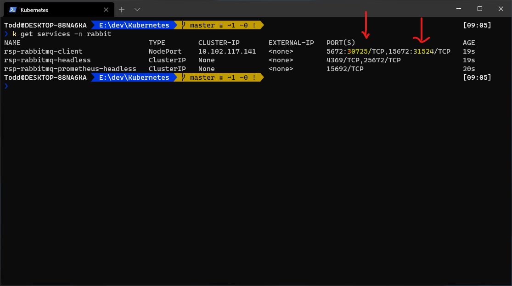

# RabbitMQ Kubernetes Deployment
Deploying [RabbitMQ](https://www.rabbitmq.com/) into Kubernetes can be difficult to get correct. Thankfully, VMware has written a [Kubernetes Operator](https://www.rabbitmq.com/kubernetes/operator/operator-overview.html) to simplify the deployment. This guide will install the Operator and then use the Operator to deploy a RabbitMQ cluster.

## Install VMWare RabbitMQ Operator

1. Clone the [VMWare RabbitMQ Operator](https://github.com/rabbitmq/cluster-operator) into a directory on your computer.

    ```
    c:\dev> git clone https://github.com/rabbitmq/cluster-operator.git
    ```
    
2. Change your directory into the cloned Operator repository.

    ```
    c:\dev> cd cluster-operator
    ```
    
3. Deploy the rabbitmq-system namespace into Kubernetes.

    ```
    c:\dev\cluster-operator> kubectl create -f .\config\namespace\base\namespace.yaml
    ```
    
4. Deploy the custom resource definition into Kubernetes.

    ```
    c:\dev\cluster-operator> kubectl create -f .\config\crd\bases\rabbitmq.com_rabbitmqclusters.yaml
    ```
    
5. Deploy the operators role based access control into Kubernetes.

    ```
    c:\dev\cluster-operator> kubectl -n rabbitmq-system create --kustomize config/rbac/
    ```
    
6. Deploy the operator manager into Kubernetes.

    ```
    c:\dev\cluster-operator> kubectl -n rabbitmq-system create --kustomize .\config\manager\
    ```
    

At this point Kubernetes is downloading and starting the pods needed to create RabbitMQ Clusters. Before you can follow the steps to create a RabbitMQ Cluster you must wait for the pods to get running. You can verify the pods are running by executing the following from powershell. Wait until the pod has 1/1 running. CTRL + C will break out of the command.

```
c:\dev\cluster-operator> while($true){ clear; kubectl get pods -n rabbitmq-system; Start-Sleep -s 5; }
```    

## Deploy the RabbitMQ Cluster

Now that the VMware RabbitMQ Operator is running, we can use it to create a fully functional RabbitMQ Cluster. The deployment code in this repository uses Kustomize to apply different config options per environment. For example, when running locally, you only want a cluster of 1 pod running. When running in production, you will want more.

1. Create a namespace for the rabbit cluster in Kubernetes.

    ```
    c:\dev\CaaS-Deployment> kubectl create namespace rabbit
    ```
2. Deploy the cluster into the namespace you created in step 1.

    ```
    c:\dev\CaaS-Deployment> kubectl apply -k ./rabbit/environments/local -n rabbit
    ```
    

Kubernetes is now downloading and creating the resources needed for your RabbitMQ Cluster. Verify that it is complete by running the following command and wait until you see 1/1 Running. CTRL + C will break out of the command.

```
C:\dev\Caas-Deployment> while($(true){ clear; kubectl get pods -n rabbit; Start-Sleep -s 5;}
```

## Post Deployment
The RabbitMQ Operator creates a service resource used to connect to the RabbitMQ AMQP and management interface ports. Execute the following command to get the port numbers that its using. If you are deploying the local environment, the rsp-rabbitmq-client will have the port mappings.

```
c:\dev\CaaS-Deployment> kubectl get services -n rabbit
```



In the above instance, the RabbitMQ management interface will be available at http://localhost:31654 and the RabbitMQ AMQP host and port is localhost 32019. The username and password is admin.

    